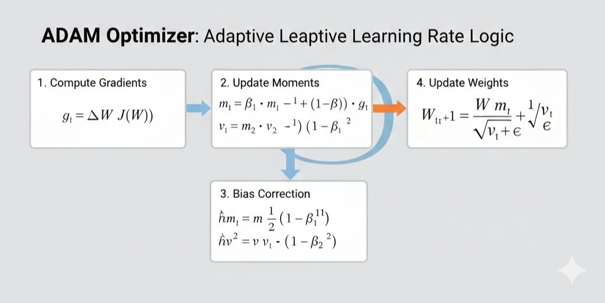

# Handwritten Digit Recognition: A From-Scratch Neural Engine
**Author:** Rohit, M.Tech Aerospace Engineering (IIT Kanpur)  
**Technical Focus:** Vectorized Linear Algebra, ADAM Optimization, and Manifold Analysis

---

## Section 1: Project Overview & Executive Summary

### 1.1 Problem Statement
In the field of computer vision, handwritten digit recognition (MNIST) serves as the primary benchmark for architectural efficiency. The objective was to design and implement a **Deep Neural Network (DNN)** built entirely from the ground up using **NumPy**, deliberately bypassing high-level frameworks like TensorFlow or PyTorch. This approach demonstrates a deep mastery of backpropagation mechanics and numerical stability.

### 1.2 Model Architecture Visualized
The network is structured as a feed-forward engine with the following topology:

**

### 1.3 Key Performance Indicators (KPIs)
The model underwent rigorous training and validation to achieve industry-standard performance:

* **Final Test Accuracy:** **96.62%**
* **Verification Accuracy:** **96.59%** (Secondary test on 10,000 unseen images)
* **Architectural Depth:** 3-Layer Fully Connected Network with 512 Hidden Neurons
* **Training Stability:** Successfully reached convergence over 40 epochs without gradient explosion.

---

## 1.4 Technical Architecture & Mathematics

### I. Model Topology
The architecture is designed to map high-dimensional pixel data into a categorical probability space:

* **Input Layer ($X$):** 784 units (Flattened 28x28 grayscale images).
* **Hidden Layer ($H_1$):** 512 neurons with **He Initialization** ($W \sim \mathcal{N}(0, \sqrt{2/n_{in}})$) to prevent signal saturation in the ReLU activation.
* **Output Layer ($Y$):** 10 neurons with **Softmax** activation for probability distribution.

### II. Optimization Stack: The ADAM Algorithm
To achieve fast convergence, I implemented the **ADAM Optimizer**, which utilizes adaptive moment estimation:

**

* **Momentum:** Implemented first-order ($m$) and second-order ($v$) moment estimations. 
* **Dropout Regularization:** Integrated a **10% Dropout** rate to force the network to learn robust feature representations.
* **Learning Rate Decay:** An 80% decay schedule every 5 epochs ensures the optimizer settles smoothly into the global minimum.

### III. Vectorized Computation
The engine is strictly vectorized using **NumPy** for maximum computational efficiency:

* **Batch Size:** 256 samples per iteration.
* **Forward Prop:** $Z = X \cdot W^T + b$.
* **Backward Prop:** Multi-layer chain rule implementation with L2 weight penalty.

---