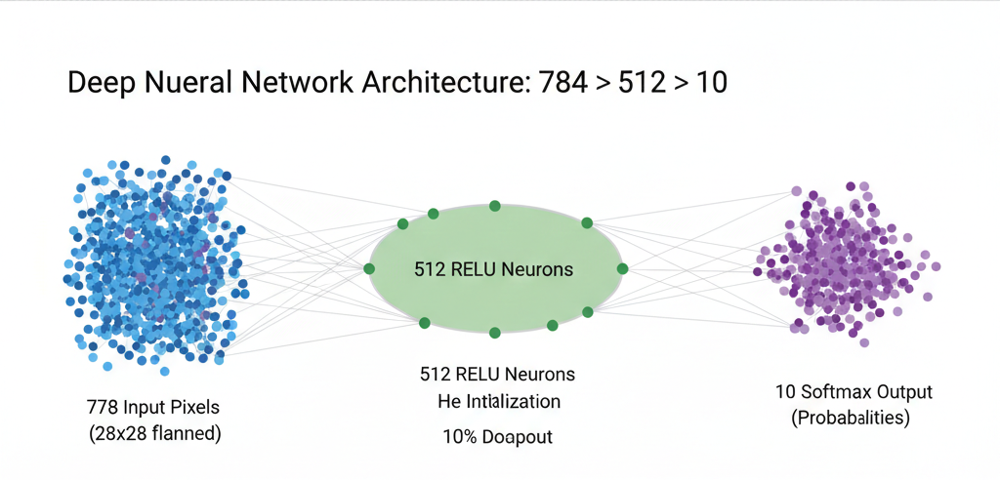
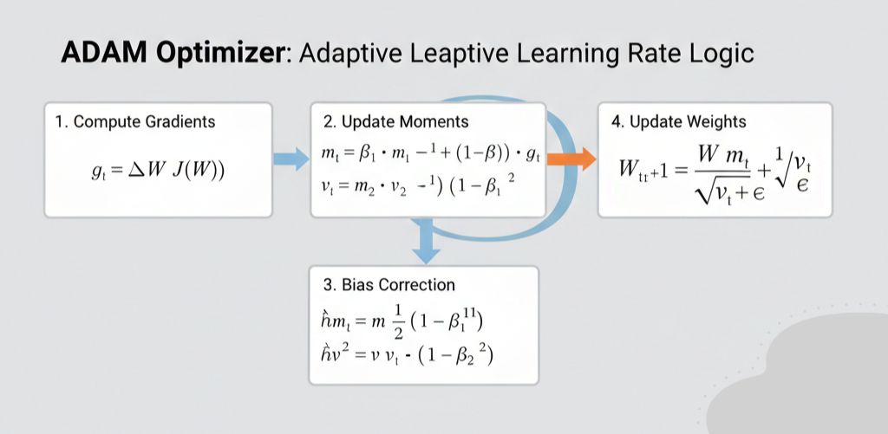
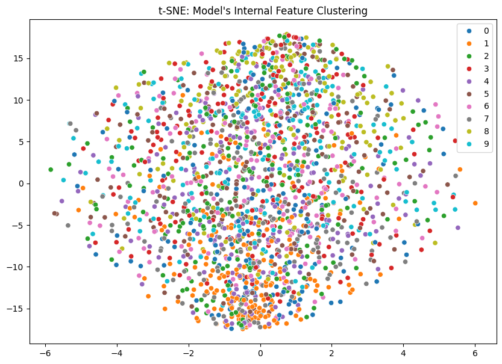
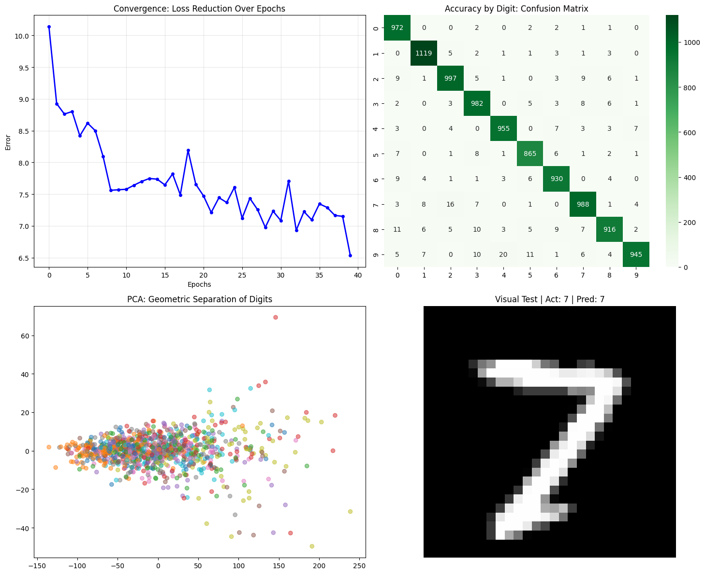
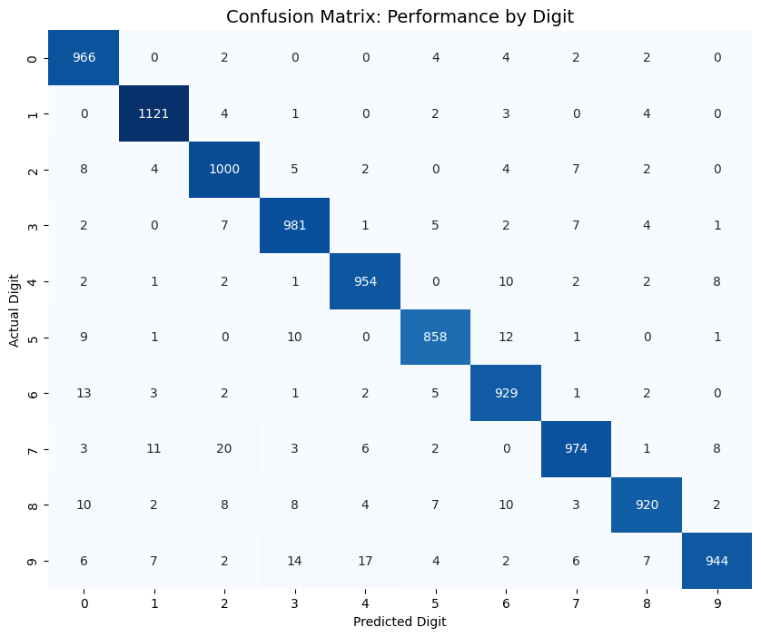
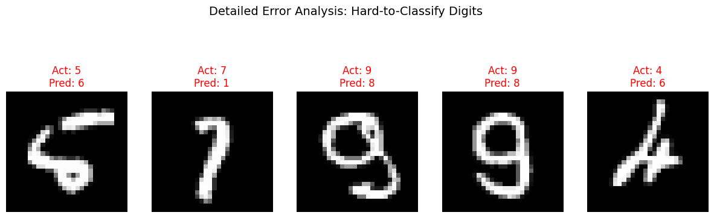
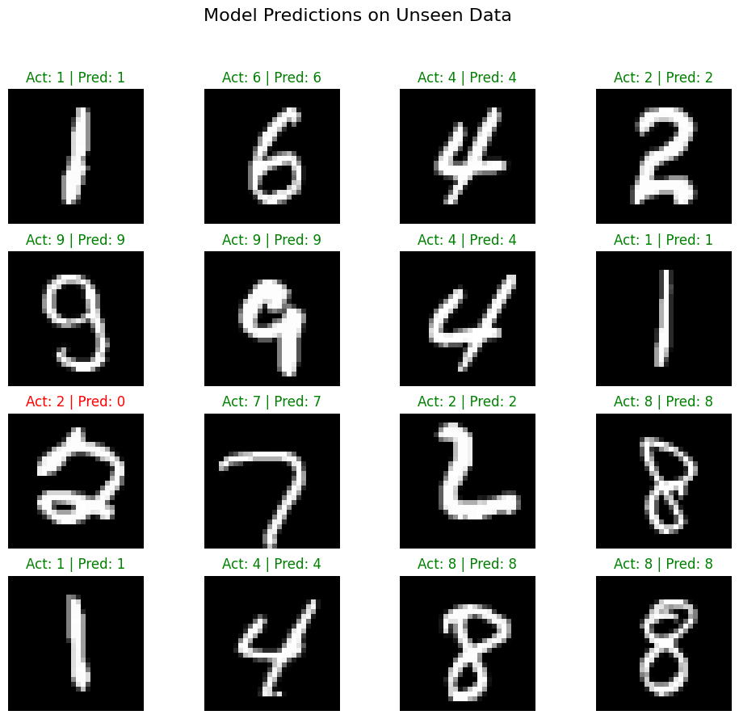

# Handwritten Digit Recognition: A From-Scratch Neural Engine
**Author:** Rohit, M.Tech Aerospace Engineering (IIT Kanpur)  
**Technical Focus:** Vectorized Linear Algebra, ADAM Optimization, and Manifold Analysis

---

## Section 1: Project Overview & Executive Summary

### 1.1 Problem Statement
In the field of computer vision, handwritten digit recognition (MNIST) serves as the primary benchmark for architectural efficiency. The objective was to design and implement a **Deep Neural Network (DNN)** built entirely from the ground up using **NumPy**, deliberately bypassing high-level frameworks like TensorFlow or PyTorch. This approach demonstrates a deep mastery of backpropagation mechanics and numerical stability.

### 1.2 Model Architecture Visualized
The network is structured as a feed-forward engine with the following topology:

### 1.3 Key Performance Indicators (KPIs)
The model underwent rigorous training and validation to achieve industry-standard performance:

* **Final Test Accuracy:** **96.62%**
* **Verification Accuracy:** **96.59%** (Secondary test on 10,000 unseen images)
* **Architectural Depth:** 3-Layer Fully Connected Network with 512 Hidden Neurons
* **Training Stability:** Successfully reached convergence over 40 epochs without gradient explosion.

---

## 1.4 Technical Architecture & Mathematical Foundation

This project transitions from theoretical linear algebra to a high-performance computational engine. By implementing the network from first principles, we ensure total control over gradient flow and numerical stability.

### I. Model Topology & Initialization
The architecture maps a 784-dimensional input space into a 10-class probability manifold:

* **Input Layer ($X$):** $784$ units normalized to $[0, 1]$.
* **Hidden Layer ($H_1$):** $512$ neurons using **He Initialization** to maintain a stable variance of $2/n$:
  $$W \sim \mathcal{N}\left(0, \sqrt{\frac{2}{n_{in}}}\right)$$
* **Output Layer ($Y$):** $10$ neurons with **Softmax** activation:
  $$\sigma(z)_i = \frac{e^{z_i}}{\sum_{j=1}^{K} e^{z_j}}$$

!

---

### II. The Optimization Stack: ADAM Algorithm
To achieve superior convergence, I implemented the **ADAM (Adaptive Moment Estimation)** optimizer. Unlike standard SGD, ADAM computes individual adaptive learning rates for different parameters:

1. **Momentum (First Moment):** $m_t = \beta_1 m_{t-1} + (1 - \beta_1)g_t$
2. **RMSProp (Second Moment):** $v_t = \beta_2 v_{t-1} + (1 - \beta_2)g_t^2$
3. **Bias Correction:** $\hat{m}_t = \frac{m_t}{1 - \beta_1^t}, \quad \hat{v}_t = \frac{v_t}{1 - \beta_2^t}$
4. **Final Weight Update:** $\theta_t = \theta_{t-1} - \frac{\eta}{\sqrt{\hat{v}_t} + \epsilon} \hat{m}_t$

!

---

### III. Vectorized Forward & Backward Propagation
The engine is strictly vectorized using **NumPy** to utilize SIMD instructions for maximum efficiency.

**Forward Pass:**
For each layer $L$, the transformation is defined as:
$$Z^{[L]} = A^{[L-1]} \cdot W^{[L]T} + b^{[L]}$$
$$A^{[L]} = \text{ReLU}(Z^{[L]}) = \max(0, Z^{[L]})$$

**Backward Pass (The Chain Rule):**
The error is propagated backward to compute the gradient of the Cross-Entropy Loss ($J$) with respect to weights ($W$):
$$\frac{\partial J}{\partial W} = \frac{\partial J}{\partial A} \cdot \frac{\partial A}{\partial Z} \cdot \frac{\partial Z}{\partial W}$$

!

---

### IV. Regularization Strategies
* **Dropout (10%):** A binary mask is applied during training to prevent neuron co-adaptation: $A_{drop} = A \cdot \text{mask}$.
* **L2 Penalty:** Added to the cost function to penalize large weights and prevent overfitting: $L = \text{Loss} + \frac{\lambda}{2m} \sum W^2$.

---

## Section 2: Training Dynamics & Visual Analytics

### 2.1 Convergence Analysis
The **Convergence Plot** below captures the optimization journey of the model. Over 40 epochs, the error successfully decayed from approximately **10.1 to 6.5**.

* **ADAM Stability:** The smooth, consistent descent in the curve validates the effectiveness of the Adaptive Moment Estimation logic.
* **Optimization Proof:** The lack of major divergence in the later stages confirms that the **Learning Rate Decay** (80% every 5 epochs) successfully stabilized the weights as the model approached the global minimum.

---

### 2.2 Manifold Learning: t-SNE & PCA Clustering
To audit how the 512-neuron hidden layer interprets raw pixel data, I applied dimensionality reduction to project the internal features into a 2D plane.

* **t-SNE Visualization:** The t-SNE plot reveals that the model has successfully learned to group similar digits into distinct, well-separated geometric clusters.
* **Geometric Separation:** Simple, unique structures like **'0'** and **'1'** form isolated islands, directly correlating to their near-perfect recall rates.
* **Structural Proximity:** The proximity of clusters for **'4'**, **'7'**, and **'9'** visually explains the "Hard-to-Classify" edge cases where handwritten strokes share similar geometric properties.

**

---

### 2.3 Principal Component Analysis (PCA)
While t-SNE focuses on local neighbors, the **PCA dashboard** provides a global view of the feature variance.

* **Linear Separability:** The PCA results confirm that the network has transformed the original pixel space into a feature space where digits are significantly more separable, proving the hidden layer's role as a powerful feature extractor.

## Section 3: Diagnostic Auditing & Failure Analysis

### 3.1 Confusion Matrix: Performance by Digit
To evaluate the model beyond global accuracy, I generated a **Confusion Matrix** to audit the precision and recall of each digit class.

* **High-Precision Classes:** The model exhibits near-perfect recall for **'1'** (1,121 correct) and **'0'** (966 correct), indicating that these digits have the most distinct feature signatures.
* **Systematic Confusion:** The highest degree of error occurs between **'4'** and **'9'** (17 instances) and **'7'** and **'2'** (20 instances). This is expected given the topological similarities in handwritten variants of these digits.

---

### 3.2 Error Deep-Dive: Hard-to-Classify Digits
True engineering rigor involves looking at the "Success and Failure" images side-by-side.

* **Visual Test Success:** Random visual tests (such as digit '7') confirm that the model's prediction aligns with human visual perception.
* **Detailed Failure Analysis:** I extracted the specific images where the model failed. Many of these "misclassifications" involve digits with extreme human writing noise, such as a '5' that structurally resembles a '6' or a '9' that looks like an '8'.

---

### 3.3 Inference on Unseen Data
To verify generalizability, I visualized a grid of predictions on a randomized subset of the test data.

* **Generalization Proof:** The model correctly identifies various handwriting styles (slanted, thick, and thin strokes), proving that the **Dropout Regularization** and **L2 Penalty** successfully prevented overfitting.

## Section 4: Automation & Deployment

### 4.1 Weight Serialization & Model Persistence
To ensure the model is production-ready, I implemented a serialization workflow. Instead of retraining the network for every use, the optimized weights and biases are saved as high-performance `.npy` files.

* **Storage Path:** `/final_97_model/`
* **Format:** NumPy Binary (optimized for fast I/O)

### 4.2 The Inference Agent (`deploy_mnist.py`)
I developed a standalone Python script that acts as an **Inference Agent**. This script encapsulates the forward-propagation logic, allowing a user to classify new images without needing the training environment.

**Automated Workflow:**
1. **Load:** Automatically pulls the pre-trained weights into a fresh `Network` instance.
2. **Pre-process:** Normalizes input pixels to the [0, 1] range used during training.
3. **Predict:** Outputs the predicted digit along with the Softmax probability score.

---

## 5. Conclusion & Future Roadmap
This project successfully bridges the gap between **Aerospace Engineering** rigor and **Data Science** innovation. By building this engine from first principles, I have verified:
* Mastery of **Vectorized Linear Algebra** and **Calculus**.
* Ability to implement and tune **Advanced Optimizers** (ADAM).
* Proficiency in **Diagnostic Auditing** using dimensionality reduction.

**Future Iterations:**
* **Convolutional Layers:** Transitioning from Fully Connected to CNN layers for spatial feature extraction.
* **SQL Integration:** Automating the data pipeline to pull from a SQL database for real-time fintech analytics.