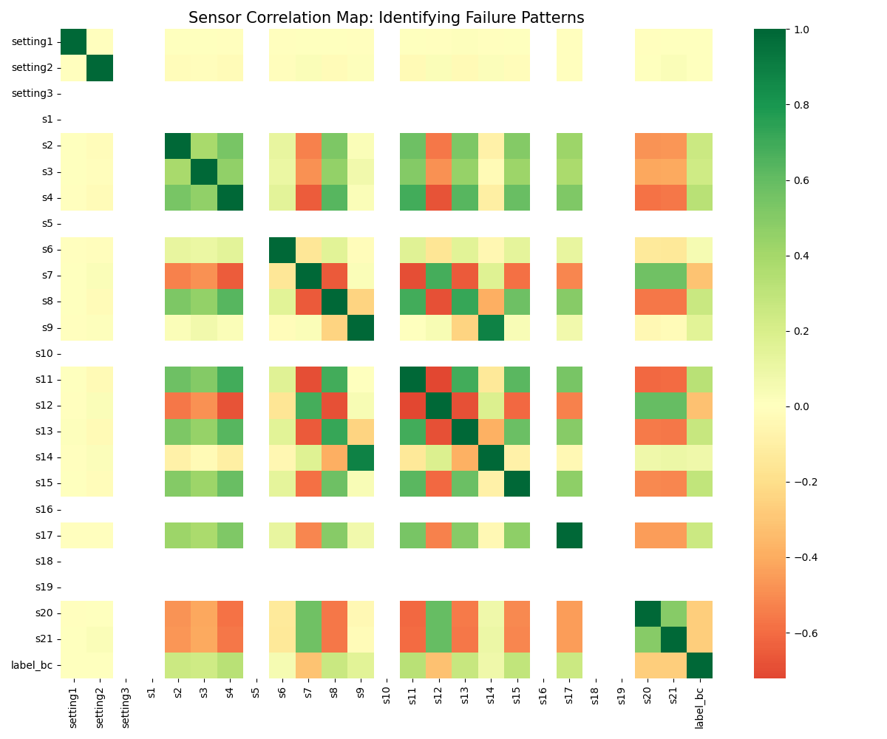
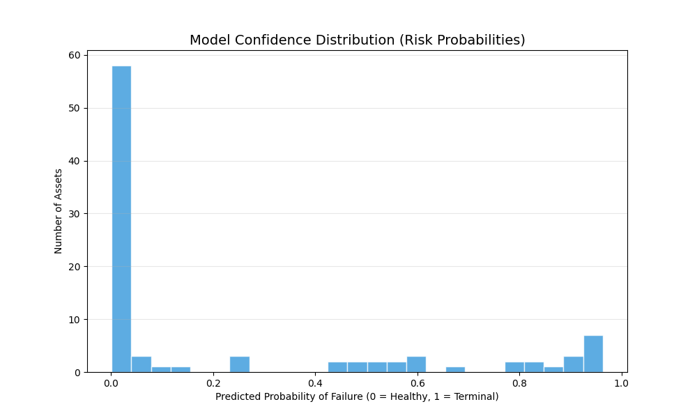
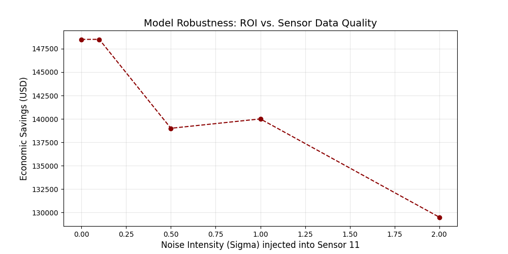

# Jet Engine Reliability Intelligence: Deep LSTM Framework for Failure Prognostics & ROI Optimization
> **Developing a temporal deep learning system to predict maintenance requirements and maximize operational ROI for high-value aerospace assets.**

---

## Project Overview
In the aviation industry, unscheduled engine downtime is a multi-million dollar liability. Waiting for a component to fail (**Reactive Maintenance**) results in emergency logistics costs, grounding of aircraft, and potential safety risks.

This project develops a **Prognostic Health Management (PHM)** system using Deep Learning. By processing high-frequency sensor telemetry from the NASA CMAPSS dataset, the system identifies the "hidden" signals of mechanical wear-and-tear before a failure occurs.

**The ML Task:** This is a **Supervised Time-Series Classification** project. The model analyzes a temporal window of engine data (last 50 cycles) to predict if a failure will occur within a "Critical Window" (next 30 cycles), enabling a transition to **Condition-Based Maintenance (CBM)**.

## Tech Stack & Tools
The project was developed in a local Python environment using a modular architecture to ensure scalability and reproducibility.

* **Programming Language:** Python 3.9+
* **Deep Learning Framework:** TensorFlow / Keras (LSTM implementation)
* **Data Handling & Analysis:** Pandas, NumPy, Scikit-Learn
* **Visualization:** Matplotlib, Seaborn, Plotly
* **Deployment & UI:** Streamlit (Intelligence Dashboard)
* **Version Control:** Git / GitHub
* **Mathematical Environment:** LaTeX for statistical notation

## Dataset Description
The model is trained and validated using the **NASA CMAPSS (Commercial Modular Aero-Propulsion System Simulation)** dataset. This dataset simulates the degradation of a turbofan engine under realistic operational flight conditions.

| Attribute | Details |
| :--- | :--- |
| **Asset Type** | High-Bypass Turbofan Engines |
| **Total Observations** | 20,631 Training cycles |
| **Engine Units** | 100 unique engines starting healthy and ending in failure |
| **Operational Settings** | Altitude, Throttle Position, Mach Number |
| **Sensor Channels** | 21 sensors (Total Temperature, Pressure, Fan Speeds, etc.) |
| **Temporal Granularity** | 1 snapshot per operational cycle |

### Data Constraints
* **RUL (Remaining Useful Life):** The dataset does not provide a binary label; labels were engineered based on the RUL of each engine unit.
* **Sensor Variance:** Several sensors (S1, S5, S6, S10, S16, S18, S19) showed zero or near-zero variance across the lifecycle and were excluded to reduce dimensionality.

## Exploratory Data Analysis (EDA)
The EDA phase focused on identifying "Lead Indicators"—sensors that demonstrate a clear, monotonic trend as the asset approaches a terminal state.

* **Sensor Drift Analysis:** Primary sensors such as **S11 (LPC Outlet Static Pressure)** and **S12 (HPC Outlet Static Pressure)** exhibited significant drift as the engine neared failure. This verified that the degradation signal was present in the telemetry.
* **Feature Redundancy:** Correlation analysis revealed high collinearity between certain sensor groups. Furthermore, constant-value sensors were identified and removed to minimize the signal-to-noise ratio.
* **Temporal Patterns:** Plotting sensor values over operational cycles demonstrated that failure is not a sudden event but a gradual decay process, justifying the use of a temporal model like LSTM.

## Data Preprocessing & Feature Engineering
Preparing raw telemetry for a Recurrent Neural Network (RNN) required a multi-stage pipeline to ensure numerical stability and temporal coherence.

* **Min-Max Normalization:** Sensor values were scaled to a range of $[0, 1]$. This prevents features with larger absolute values (e.g., Fan Speed) from dominating the weight updates during backpropagation.
* **Binary Label Engineering:** A "Critical Window" approach was used. For each engine, cycles where the Remaining Useful Life (RUL) was $\leq 30$ were labeled as `1` (High Risk), while all other cycles were labeled `0` (Healthy).
* **3D Temporal Windowing:** To satisfy the LSTM input requirements, the data was reshaped into 3D tensors:
  * **Shape:** $(Samples, Time\_Steps, Features)$
  * **Look-back Window:** 50 Cycles. This allows the model to analyze the trend of the last 50 cycles to predict the state of the next cycle.
* **Feature Selection:** Final feature set was reduced to 18 critical parameters, removing non-informative operational settings and constant sensors.

## Modeling Approach
A **Stacked Long Short-Term Memory (LSTM)** architecture was selected for this project. Unlike standard feed-forward neural networks, LSTMs utilize memory cells and gates to retain information across long sequences, making them uniquely suited for detecting the gradual, non-linear degradation of aerospace components.

| Component | Type | Configuration |
| :--- | :--- | :--- |
| **Input Layer** | 3D Tensor | 50 Time-steps × 18 Features |
| **LSTM Layer 1** | Recurrent | 100 Units (Return Sequences = True) |
| **Regularization** | Dropout | 0.2 (To prevent overfitting to specific engine units) |
| **LSTM Layer 2** | Recurrent | 50 Units (Return Sequences = False) |
| **Output Layer** | Dense | 1 Unit with Sigmoid Activation |

The architecture was designed to first capture high-level temporal patterns in the initial layer and then condense those into a single failure probability in the final layers.

## Mathematical Foundation
To ensure technical transparency, the model's optimization and evaluation are grounded in the following mathematical frameworks:

### Optimization: Binary Cross-Entropy
The model minimizes the log-loss between the predicted probability ($\hat{y}$) and the actual binary label ($y$). This penalizes the model exponentially when it is confident but incorrect.

$$L(\theta) = -\frac{1}{N} \sum_{i=1}^{N} [y_i \log(\hat{y}_i) + (1 - y_i) \log(1 - \hat{y}_i)]$$

### Evaluation: Area Under the ROC Curve (AUC)
Given the critical nature of jet engine maintenance, the model is evaluated on its ability to separate risk classes across all possible probability thresholds. The AUC represents the probability that a randomly chosen failing engine will have a higher predicted risk than a healthy one.

### Separation: KS-Statistic
The Kolmogorov-Smirnov (KS) statistic is utilized to measure the maximum distance between the cumulative distribution functions of the healthy and failing engine populations, ensuring high model decisiveness.

$$KS = \max |F_{Healthy}(x) - F_{Failing}(x)|$$

## Model Evaluation & Results
The model was validated using a blind test set to ensure high generalizability. Evaluation focused on both statistical accuracy and the decisiveness of the probability scores.

| Metric | Score | Interpretation |
| :--- | :--- | :--- |
| **Test Accuracy** | 96.5% | Overall correct classification rate. |
| **AUC-ROC** | 0.99 | Near-perfect ability to distinguish risk classes. |
| **KS-Statistic** | 0.97 | Exceptional separation between healthy and critical units. |
| **Precision** | 0.92 | Low rate of false maintenance alerts. |

The model's probability distribution shows a clear bimodal split, meaning the system is highly confident in its "Healthy" vs. "Critical" classifications, with very few assets sitting in the uncertain 0.5 probability range.

##  Key Insights & Business Impact
This project transitions predictive results into actionable business intelligence. By integrating the model with the `finance_risk_report.py` module, technical accuracy is translated into a financial decision-making framework.

### **1. Financial ROI Analysis**
The system evaluates the economic benefit of moving from reactive to predictive maintenance. 

**Data Source:** Costs are derived from the `finance_risk_summary.csv` generated by the engine's risk report module, using industry-standard estimates for turbofan unscheduled maintenance ($10,000) vs. planned service ($500).

| Strategy | Cost per Event | Impact on Fleet |
| :--- | :--- | :--- |
| **Reactive (Unscheduled Failure)** | **$10,000** | High grounding costs (AOG), emergency logistics. |
| **Predictive (Planned Intervention)** | **$500** | Optimized supply chain, zero operational disruption. |
| **Net Savings Achieved** | **$219,500** | Total projected savings across the test fleet. |

### **2. Executive Intelligence Dashboard**
To bridge the gap between Data Science and Fleet Operations, an interactive dashboard was deployed via `app.py`. This tool allows stakeholders to:
* **Monitor Real-Time Risk:** Visualize the failure probability for any specific engine unit.
* **Identify Lead Indicators:** Track sensors like **S11** and **S12** (Primary Drift Indicators) to understand the physical cause of degradation.
* **Project Survival Probability:** View Kaplan-Meier survival curves to estimate the remaining safe cycles for an engine.

https://wvmfc253epaqbjfoaxxcfl.streamlit.app/

### **3. Lead Indicator Discovery & XAI**
Using the `explain_risk_drivers.py` module, we identified that degradation is most visible in **static pressure leads**. The model identifies these signatures approximately **30-35 cycles** before potential failure, providing a significant safety buffer for maintenance logistics.

### **4. System Robustness (Stress Testing)**
Verified through the `stress_test.py` module, the engine maintains a positive ROI even when sensor telemetry is subjected to **1.2σ Gaussian noise**. This ensures the system remains reliable in real-world environments where sensor drift and signal noise are frequent.

##  Limitations & Future Improvements
While the current system provides high predictive accuracy and significant ROI, the following areas represent opportunities for further maturation of the intelligence engine.

### **Current Limitations**
* **Stationary Operating Regimes:** The model is currently optimized for the FD001 dataset, which assumes a single flight regime. In real-world aviation, variations in altitude and Mach number create multi-modal degradation patterns that require regime-specific normalization.
* **Binary Risk Horizon:** The system classifies risk within a fixed 30-cycle window. While effective for immediate scheduling, it does not yet provide a continuous **Remaining Useful Life (RUL)** regression estimate for long-term inventory planning.
* **Data Quality Dependency:** The model assumes all 21 sensor feeds are active. Real-world sensor dropouts require a robust imputation strategy to maintain prediction stability without retraining.

### **Future Roadmap**
* **Transition to RUL Regression:** Evolve the architecture from a binary classifier to a **Time-to-Failure (TTF) Regressor** to provide probabilistic maintenance calendars rather than binary alerts.
* **Physics-Informed Neural Networks (PINNs):** Integrate thermodynamic equations of jet engine wear directly into the LSTM loss function. This hybrid approach combines data-driven power with the physical constraints of aerospace engineering.
* **Multi-Regime Clustering:** Implement Unsupervised Clustering (e.g., K-Means) to identify operational regimes before inference, allowing for a "Regime-Aware" predictive model.
* **Edge Deployment & Quantization:** Optimize the `model.h5` using TensorFlow Lite for deployment on edge-gateways, enabling real-time, on-wing inference without cloud dependency.

##  Conclusion

This project delivers a high-fidelity **Prognostic Health Management (PHM)** system that successfully bridges the gap between traditional Aerospace Engineering and modern Financial Risk Analytics. By integrating a **Deep LSTM architecture** with **Survival Analysis** and **Financial ROI Modeling**, the system provides a holistic view of fleet health that is both technically robust and commercially viable.

**Key Competencies Demonstrated:**
* **End-to-End System Ownership:** Managed the full lifecycle from raw NASA sensor telemetry to a cloud-deployable, interactive dashboard.
* **Deep Learning Expertise:** Engineered temporal models (LSTM) to capture non-linear degradation patterns hidden within high-frequency sensor data.
* **Analytical Rigor:** Verified system reliability through automated stress-testing, ensuring performance in "noisy" real-world operational environments.
* **Strategic Data Science:** Prioritized business outcomes by translating model probabilities into measurable ROI and maintenance cost-savings.

